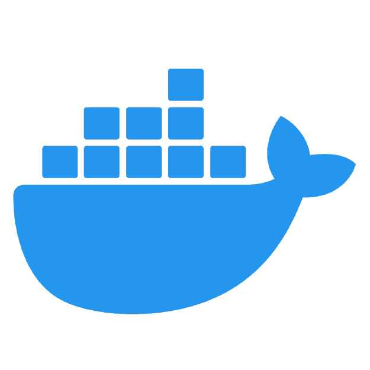

<h1> Docker Environment Manager</h1>

[](https://github.com/Nitinx12/docker-environment-manager/actions/workflows/tests.yml)

A cross-platform Docker Compose automation toolkit — the same start/stop/health/backup commands, with identical flags and behavior, whether your team is on Bash or PowerShell.

---

## The Problem

Most teams end up with Docker lifecycle tooling that only works for some of them:

- **Compose commands get long and easy to get wrong.** `docker compose -f docker/docker-compose.yml -p myproject up -d --build` is not something anyone wants to type or remember correctly every time, across every service.
- **"Works on my machine" setup.** A Bash script in `scripts/` works great for the Linux/macOS half of the team and silently doesn't exist for whoever's on native Windows, so Windows contributors end up with their own one-off `.ps1` files that drift out of sync with the "real" ones over time.
- **No standard way to know if the stack is actually healthy**, back up a volume before a risky change, or restore one after something goes wrong so everyone reaches for `docker` directly, inconsistently, under pressure.
- **Onboarding a new machine means manually installing the right shell, Docker, and linters** in the right versions before anyone can run anything.

None of this is hard individually. It's just tedious, easy to get subtly wrong, and different enough per developer that debugging someone else's environment issue becomes its own project.

## What This Solves

Docker Environment Manager wraps Docker Compose in a small, well-tested command layer that behaves identically no matter who's running it:

- **One set of commands, two shells.** Every script (`start`, `stop`, `restart`, `cleanup`, `logs`, `health`, `backup`, `restore`) exists as both a `.sh` and a `.ps1` with the same flags, same defaults, and same exit codes — see [`docs/BASH.md`](docs/BASH.md) and [`docs/POWERSHELL.md`](docs/POWERSHELL.md).
- **Config lives in one `.env` file**, with CLI flags able to override it per-invocation — no more remembering project names or compose file paths.
- **Built-in health polling**, so `start.sh` (or `health.sh` on its own) can tell you the stack is actually ready, not just that containers exist.
- **Cross-platform volume backup/restore** through a throwaway container, so there's a real answer to "how do I snapshot this volume before I touch it" on any OS.
- **A ready-to-go Dev Container** so a new machine gets Docker CLI access, PowerShell, and ShellCheck without a manual install checklist.
- **CI tests and lints both script sets on every push** (Bats + ShellCheck for Bash, Pester + PSScriptAnalyzer for PowerShell, across a 3-OS matrix), and tagged releases package both script sets as downloadable assets — see [`ARCHITECTURE.md`](ARCHITECTURE.md).

## Quick Start

```bash
git clone https://github.com/Nitinx12/docker-environment-manager.git
cd docker-environment-manager
code .   # then "Reopen in Container" when prompted
./scripts/bash/start.sh -b
```

Full walkthrough: [`QUICKSTART.md`](QUICKSTART.md).

## Documentation

| Doc | Read this for... |
|---|---|
| [`QUICKSTART.md`](QUICKSTART.md) | The fastest path to a running stack |
| [`INSTALLATION.md`](INSTALLATION.md) | Full setup — Dev Container or manual, requirements, `.env` configuration |
| [`ARCHITECTURE.md`](ARCHITECTURE.md) | How it's built: components, data flow, design decisions |
| [`CLI_REFERENCE.md`](CLI_REFERENCE.md) | Every script, every flag, defaults, and examples |
| [`docs/BASH.md`](docs/BASH.md) | Bash-specific usage, requirements, testing & linting |
| [`docs/POWERSHELL.md`](docs/POWERSHELL.md) | PowerShell-specific usage, requirements, testing & linting |

## Testing

```bash
bats tests/bash            # Bash suite
```
```powershell
Invoke-Pester -Path ./tests/powershell   # PowerShell suite
```

Both suites run against a mocked `docker` binary, so no real Docker daemon is required. Details in [`docs/BASH.md#testing--linting`](docs/BASH.md#testing--linting) and [`docs/POWERSHELL.md#testing--linting`](docs/POWERSHELL.md#testing--linting).

## Contributing

Pull requests should pass the same checks CI runs: ShellCheck + Bats for anything under `scripts/bash/`, PSScriptAnalyzer + Pester for anything under `scripts/powershell/`. If you touch one language's script, please mirror the change in the other so the two stay in parity.
