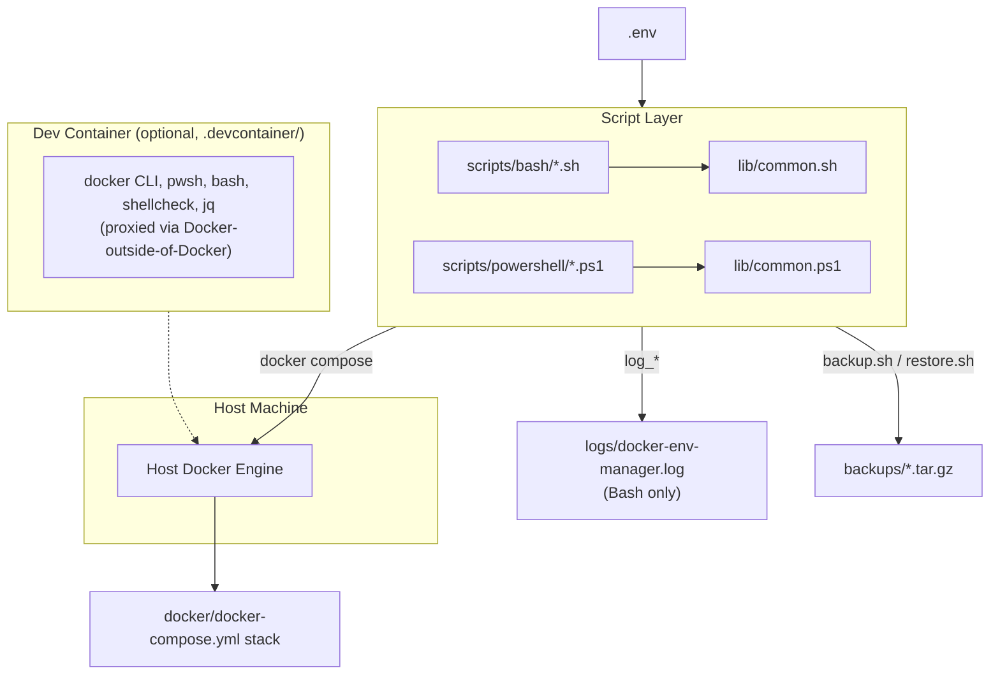
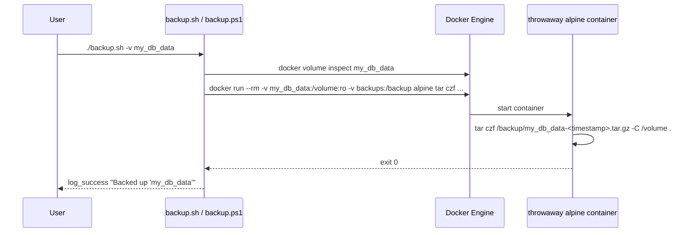
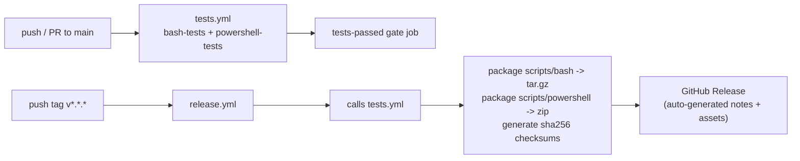

# Architecture

This document describes how Docker Environment Manager is put together: the runtime components, how they talk to each other, and the design decisions behind them. For "how do I use it," see [`QUICKSTART.md`](QUICKSTART.md) or [`CLI_REFERENCE.md`](CLI_REFERENCE.md).

---

## Overview

Docker Environment Manager is a **thin automation layer over Docker Compose**, not a service itself. There's no long-running process, database, or API — the "product" is a set of scripts (implemented twice, once in Bash and once in PowerShell, with matching behavior) that wrap `docker compose` with consistent logging, config loading, health polling, and volume backup/restore. A Dev Container provides a reproducible place to run and develop them.

---

## System Diagram



---

## Repository Layout

```
docker-environment-manager/
├── .devcontainer/
│   ├── Dockerfile              # base image + shellcheck/jq/curl
│   ├── devcontainer.json        # features: docker-outside-of-docker, powershell
│   └── post-create.sh          # installs PSScriptAnalyzer, verifies toolchain
├── .github/workflows/
│   ├── tests.yml                # CI: lint + test both script sets
│   └── release.yml              # CD: package + publish on version tags
├── docker/
│   └── docker-compose.yml      # the stack the scripts manage (placeholder demo service)
├── docs/
│   ├── BASH.md
│   └── POWERSHELL.md
├── scripts/
│   ├── bash/
│   │   ├── lib/common.sh       # logging, .env loader, preflight checks
│   │   ├── start.sh, stop.sh, restart.sh
│   │   ├── health.sh, logs.sh, cleanup.sh
│   │   └── backup.sh, restore.sh
│   └── powershell/              # same 8 scripts + lib/common.ps1, mirrored 1:1
├── tests/
│   ├── bash/                    # Bats suite + mocks/docker (stub CLI)
│   └── powershell/               # Pester suite + mocks/docker (+ docker.cmd shim)
├── backups/                      # default backup.sh output directory
├── logs/                         # created at runtime by lib/common.sh (Bash only)
└── .env                          # PROJECT_NAME, COMPOSE_FILE, HEALTH_TIMEOUT, BACKUP_DIR
```

---

## Design Principles

| Principle | How it shows up |
|---|---|
| **Bash and PowerShell are peers, not primary/fallback** | Every script exists in both languages with identical flags, defaults, and exit codes — see [`docs/BASH.md`](docs/BASH.md) / [`docs/POWERSHELL.md`](docs/POWERSHELL.md) |
| **Config precedence is uniform** | hardcoded default → `.env` → CLI flag, enforced the same way in every script |
| **Fail fast, fail clearly** | Every script calls `require_docker` / `require_command` before doing anything, so a missing dependency is reported immediately with a clear message instead of failing deep in a Docker error |
| **No hidden dependencies at runtime** | Health/status parsing uses `grep -c` (Bash) / regex (PowerShell) directly against `docker compose ps --format json` text rather than requiring `jq` — see [Design Decisions](#design-decisions) |
| **Tests don't need a real Docker daemon** | Both suites run against a stub `docker` binary (`tests/*/mocks/docker`), so CI is fast and doesn't need privileged Docker-in-Docker |

---

## Components

### 1. Dev Container

`.devcontainer/` builds a Debian (`bookworm`) container with ShellCheck, `jq`, `curl`, and `ca-certificates` baked into the image, then layers in `pwsh` and Docker CLI access via two Dev Container **features**:

- `docker-outside-of-docker` — proxies `docker`/`docker compose` inside the container to the **host's** Docker engine, rather than running a nested daemon
- `powershell` — installs PowerShell Core

`post-create.sh` runs once on container creation to install `PSScriptAnalyzer` and print toolchain versions as a sanity check. See [`INSTALLATION.md`](INSTALLATION.md).

### 2. Configuration (`.env`)

A flat `KEY=VALUE` file at the repo root, loaded by every script via `load_env` (in `common.sh`/`common.ps1`). Four variables are recognized project-wide: `PROJECT_NAME`, `COMPOSE_FILE`, `HEALTH_TIMEOUT`, `BACKUP_DIR`. Missing the file isn't an error — every script falls back to hardcoded defaults and logs a warning. See [`INSTALLATION.md#configuration`](INSTALLATION.md#configuration).

### 3. Script Layer

Eight user-facing scripts per language (`start`, `stop`, `restart`, `cleanup`, `logs`, `health`, `backup`, `restore`), each a thin wrapper around `docker compose` / `docker volume` / `docker run`. All eight share one library (`common.sh` or `common.ps1`) that provides:

- `log_info` / `log_warn` / `log_error` / `log_success` — leveled, color-coded logging
- `load_env` — `.env` loader
- `require_command` / `require_docker` — preflight checks
- Repo-root-relative path resolution (`REPO_ROOT` in Bash, `Resolve-UnderRepoRoot` in PowerShell)

`restart.sh`/`restart.ps1` don't duplicate stop/start logic — they simply invoke the other two scripts as subprocesses with the same flags. Full flag reference: [`CLI_REFERENCE.md`](CLI_REFERENCE.md).

### 4. Docker Compose Stack

`docker/docker-compose.yml` is intentionally a placeholder — a single `demo` service (`nginx:alpine`, port `8081`, with a healthcheck) so the whole toolchain (start → health poll → logs → stop) can be exercised end-to-end before anyone wires up a real stack. Swapping this file's contents for real services is the primary integration point for new projects using this toolkit.

### 5. Health Check Subsystem

`start.sh`/`start.ps1` and `health.sh`/`health.ps1` both poll `docker compose ps --format json` on a fixed 3-second interval, up to `HEALTH_TIMEOUT` seconds, counting occurrences of `"Health":"unhealthy"` and `"Health":"starting"` in the raw output. Containers with no healthcheck defined report no `Health` field and are silently ignored. This avoids depending on `jq` or any JSON parser — `grep -c` / regex matching is sufficient and keeps the scripts runnable in minimal environments outside the Dev Container.

### 6. Backup & Restore Subsystem



Both `backup.sh` and `restore.sh` stream volume contents through a short-lived `alpine:3.20` container rather than mounting the volume on the host directly — this means no host-side `tar`, no permission wrangling, and identical behavior on Linux, macOS, and Windows. With no `-v`/`--volume` flags, `backup.sh` auto-discovers every volume labeled `com.docker.compose.project=<PROJECT_NAME>`. `restore.sh` requires explicit `-v`/`-i` flags (no auto-discovery, since restoring is destructive) and prompts for confirmation unless `-y`/`--yes` is passed.

### 7. Logging

Bash and PowerShell logging are **not at full parity**: Bash's `log_*` functions write to stdout/stderr *and* append to `logs/docker-env-manager.log`; PowerShell's `log_*` functions only write to the console. See [`docs/POWERSHELL.md#logging`](docs/POWERSHELL.md#logging) for details if you're mixing both shells in one workflow.

### 8. Testing

| | Bash | PowerShell |
|---|---|---|
| Framework | [Bats-core](https://github.com/bats-core/bats-core) | [Pester](https://pester.dev/) 5.7.1 |
| Location | `tests/bash/*.bats` | `tests/powershell/*.Tests.ps1` |
| Lint | ShellCheck | PSScriptAnalyzer |
| Docker mock | `tests/bash/mocks/docker` | `tests/powershell/mocks/docker` (+ `docker.cmd` shim for Windows, since PowerShell won't resolve an extensionless file) |
| CI runners | `ubuntu-latest` | `ubuntu-latest`, `windows-latest`, `macos-latest` (matrix) |

Both mock `docker` binaries implement just enough of the CLI surface (`compose up/down/ps/logs`, `volume ls/inspect/create`, `run`) to exercise argument parsing, health-check counting, and the backup/restore file flow — without a real Docker daemon. Details: [`docs/BASH.md#testing--linting`](docs/BASH.md#testing--linting), [`docs/POWERSHELL.md#testing--linting`](docs/POWERSHELL.md#testing--linting).

### 9. CI/CD Pipeline



`release.yml` reuses `tests.yml` via `workflow_call` rather than duplicating the test steps, so a release can't ship without the full test matrix passing first. Release assets are the two script directories packaged separately (`scripts-bash-<tag>.tar.gz`, `scripts-powershell-<tag>.zip`) plus a checksums file — the toolkit is meant to be dropped into other projects, not installed as a package.

---

## Data Flow: `./start.sh -b`

1. Source `lib/common.sh` → resolve `REPO_ROOT`, create `logs/` if missing
2. `load_env` → read `.env`, fall back to defaults for anything unset
3. Parse `-b` → `BUILD_FLAG=--build`
4. `require_docker` → confirm `docker` is on `PATH` and the daemon responds to `docker info`
5. `docker compose -f <file> -p <project> up -d --build`
6. Poll `docker compose ps --format json` every 3s, counting `unhealthy`/`starting`, until healthy, unhealthy (exit 1), or `HEALTH_TIMEOUT` is reached (exit 0 with a warning either way — timeout is not treated as failure here, only explicit `unhealthy` is)

---

## Design Decisions

**Docker-outside-of-Docker over Docker-in-Docker.** The Dev Container proxies to the host daemon instead of running a nested one. This keeps the container lightweight and means volumes/images built or pulled inside the container are visible on the host (and vice versa) — but it also means the container's Docker access is only as good as whatever's running on the host.

**`jq` is installed but unused.** The Dockerfile installs it for ad-hoc use inside the Dev Container, but no script actually shells out to it — health/status parsing deliberately uses `grep -c`/regex instead, so the scripts work unmodified outside the Dev Container (a bare CI runner, a teammate's native shell) without needing to install a JSON parser first.

**PowerShell scripts parse `$args` manually instead of using native parameter binding.** This is why `-p`/`--project` works identically in both `start.sh -p foo` and `start.ps1 -p foo`, rather than PowerShell's usual `-Project foo` convention — flag parity across shells was prioritized over idiomatic PowerShell parameter style.

**Volume operations always go through a throwaway `alpine` container**, never a direct host bind-mount of the volume. Slightly slower than a raw `cp`, but avoids permission and path-translation differences between Linux, macOS, and Windows entirely.

---

## Related Documentation

| Doc | Covers |
|---|---|
| [`QUICKSTART.md`](QUICKSTART.md) | Fastest path to a running stack |
| [`INSTALLATION.md`](INSTALLATION.md) | Full setup, requirements, and `.env` configuration |
| [`CLI_REFERENCE.md`](CLI_REFERENCE.md) | Every script, every flag, defaults, and examples |
| [`docs/BASH.md`](docs/BASH.md) | Bash-specific usage, testing & linting |
| [`docs/POWERSHELL.md`](docs/POWERSHELL.md) | PowerShell-specific usage, testing & linting |